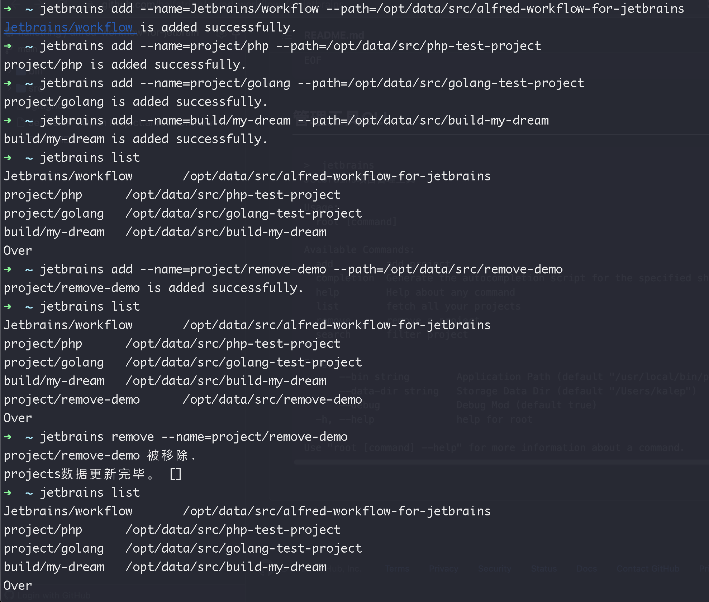
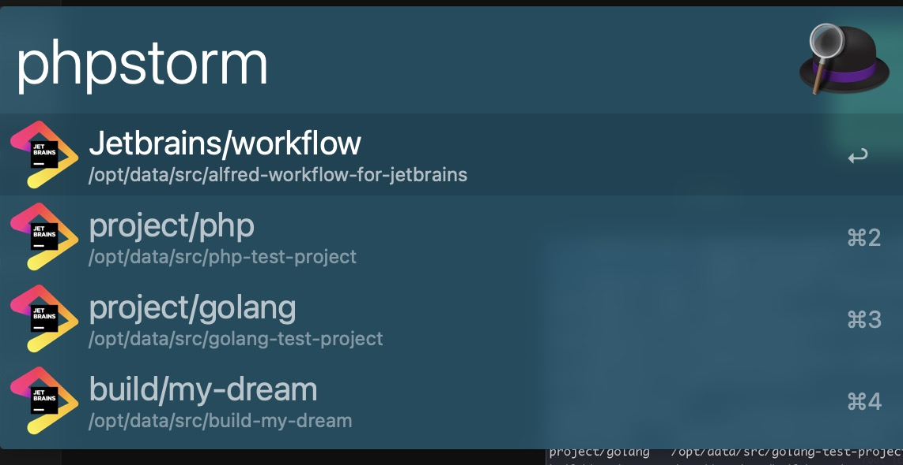

# Alfred workflow for jetbrains

## 编译处理程序(或者直接下载 bin/jetbrains)
``` 
>  go build -o jetbrains main.go
>  mv jetbrains /usr/local/bin/
```

## 创建Jetbrains命令行(以PHPStorm为例，其他App自行创建。)
```  
> cat > pstorm << EOF
#!/bin/sh

/usr/bin/open -na "/Applications/PhpStorm.app" --args "\$@"
EOF
```


## 管理工具CLI

``` 
>  jetbrains
Jetbrains项目管理工具

Usage:
  root [command]

Available Commands:
  add         add project
  completion  Generate the autocompletion script for the specified shell
  help        Help about any command
  list        fetch all your projects
  remove      remove a project
  search      filter project

Flags:
      --bin string        Application Path (default "/usr/local/bin/pstorm")
      --data-dir string   Storage Data Dir (default "/Users/kalep")
      --debug             Debug Mod (default true)
  -h, --help              help for root

Use "root [command] --help" for more information about a command.
```


## 使用效果




